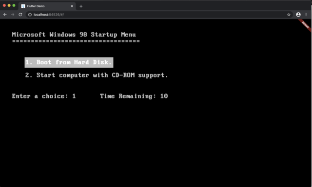
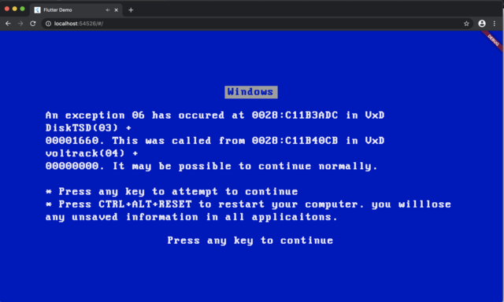
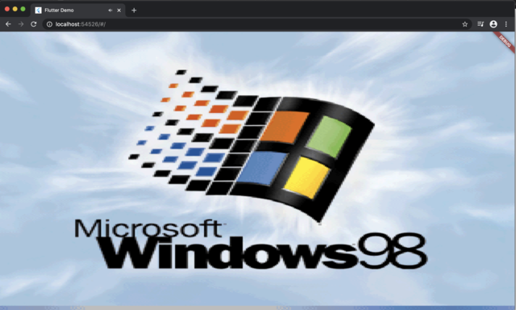
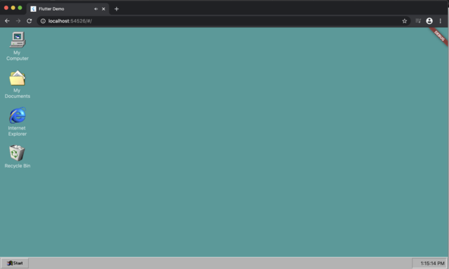
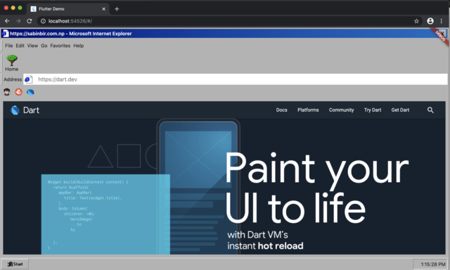

# retrowindows98

<h1 align="center">
  <br>
  <a href=""></a>
  <br>
  Windows 98 design based on Flutter for #Hack20
  <br>
  <br>
  <a href="https://gallant-tereshkova-eb2d27.netlify.app/" target="_blank">Run Demo</a>
  <br>
</h1>

## Getting Started

This project is a starting point for a Flutter application.

A few resources to get you started if this is your first Flutter project:

- Make sure you are in the `beta channel`
```
flutter channel beta
$ flutter upgrade
$ flutter config --enable-web
```
- Run the app
```
$ flutter run -d chrome
```
- [For more information on Flutter Web](https://flutter.dev/docs/get-started/web)


For help getting started with Flutter, view our
[online documentation](https://flutter.dev/docs), which offers tutorials,
samples, guidance on mobile development, and a full API reference.

## Key Features

* Boot Menu (with countdown).
* Blue Screen of Death (BSOD).
* Login And BSOD sound effect.
* Desktop (with Clock, Start menu press effect and Internet Explorer).
* Wokring Internet Explorer (Address Bar, Bookmarks, Home Button).

## Screenshots
<p float="left">
  
   
  
  
  
</p>

